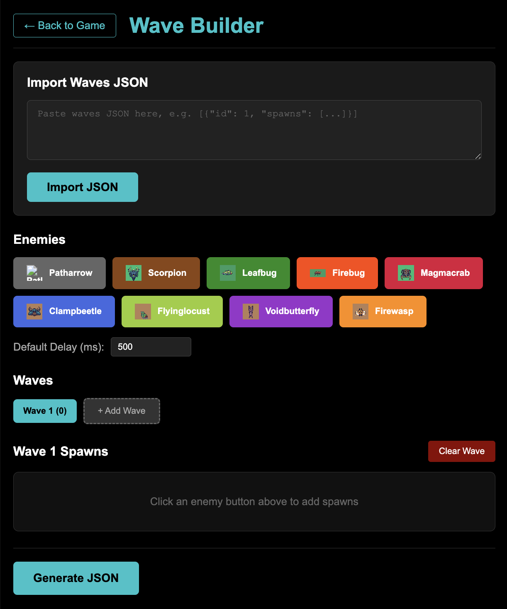
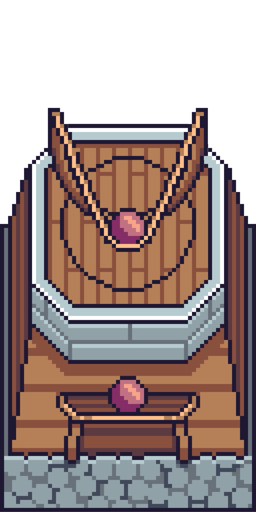

 

  

  <h1 align="center">Path of Bugs</h1>

  

    A tower-defense project built with Phaser 3, React, and TypeScript.
     
    <a href="https://pathofbugs.bonindev.com/">View Demo</a>
    ·
    <a href="#preview">Preview</a>
    ·
    <a href="#features">Features</a>
  

  
Table of Contents

  <ol>
    <li><a href="#overview">Overview</a></li>
    <li><a href="#features">Features</a></li>
    <li><a href="#controls">Controls</a></li>
    <li><a href="#preview">Preview</a></li>
    <li><a href="#tech">Tech Stack</a></li>
    <li><a href="#learning-outcomes">Learning Outcomes</a></li>
    <li><a href="#contributors">Contributors</a></li>
    <li><a href="#credits">Credits</a></li>
  </ol>

 

<!-- ******************************************************** OVERVIEW ************************************************* -->

<h2 id="overview">Overview</h2>

Path of Bugs is a tower-defense game with multiple worlds and maps. Build towers, defend your base against waves of bugs, and adapt your strategy to win each level.

  

(<a href="#readme-top">back to top</a>)

<!-- ******************************************************** FEATURES ************************************************* -->

<h2 id="features">Features</h2>

- Multiple worlds and maps with distinct paths and starting parameters.
- Different tower types (e.g., Slingshot, Catapult, Crystal) with upgrades.
- Variety of enemies with unique behavior and movement.
- Wave system with progress, win, and game-over screens.
- Ingame UI for money, health, tower selection, and build preview.
- Wave Builder route for quick iteration on enemy waves.

  
    
<em>(Wave Builder is a local developer tool and not included in the public game build.)</em>

(<a href="#readme-top">back to top</a>)

<!-- ******************************************************** CONTROLS ************************************************* -->

<h2 id="controls">Controls</h2>

- Mouse: tower placement, tower selection, UI interactions.
- Keyboard/Click: skip intro in the main menu.
- Touch (Mobile/Tablet): Tap for tower placement, selection, and UI interactions.

  

(<a href="#readme-top">back to top</a>)

<!-- ******************************************************** PREVIEW ************************************************* -->

<h2 id="preview">Preview</h2>

  

(<a href="#readme-top">back to top</a>)

<!-- ******************************************************** TECH STACK ************************************************* -->

<h2 id="tech">Tech Stack</h2>

  
  
  
  
  
  
  

- Phaser 3
- Tiled
- Aseprite
- React 19
- TypeScript 5
- Vite 6
- ESLint

(<a href="#readme-top">back to top</a>)

<!-- ******************************************************** LEARNING OUTCOMES ************************************************* -->

<h2 id="learning-outcomes">Learning Outcomes</h2>

<h3>Technical</h3>

<h4>Phaser and Game Architecture</h4>

- Learned Phaser from scratch and built a solid understanding of scenes, game flow, and entity systems.
- Structured the world logic (maps, paths, waves, UI layers) to keep gameplay readable and scalable.
- Implemented spritesheet-based animations and integrated them into enemy and UI states.

<h4>World Building and Visual Design</h4>

- Designed and iterated on maps in Tiled to balance gameplay, pacing, and clarity.
- Worked with Aseprite in the asset pipeline and adapted visuals to the game’s needs.
- Improved our sense for visual hierarchy (contrast, spacing, scaling) in a top-down game.

<h3>Organization and Project Management</h3>

- Planned features in small, testable steps and worked agile throughout the project.
- Used regular pair programming to share knowledge and avoid siloed development.
- Kept the team aligned through frequent check-ins, ensuring nobody was left behind.

(<a href="#readme-top">back to top</a>)

<!-- ******************************************************** CONTRIBUTORS ************************************************* -->

<h2 id="contributors">Contributors</h2>

(<a href="#readme-top">back to top</a>)

<!-- ******************************************************** CREDITS ************************************************* -->

<h2 id="credits">Credits</h2>

- Phaser 3 template: https://github.com/phaserjs/template-react-ts
- Tools: Phaser, React, Vite, TypeScript
- Assets: Distributed by Foozle (www.foozle.io) — License: Creative Commons Zero (CC0) http://creativecommons.org/publicdomain/zero/1.0/

(<a href="#readme-top">back to top</a>)

<!-- ******************************************************** MERCH ************************************************* -->

<h2 id="merch">Merch Mockup</h2>

  
  
Just a playful mockup to imagine Path of Bugs in the real world.

(<a href="#readme-top">back to top</a>)

